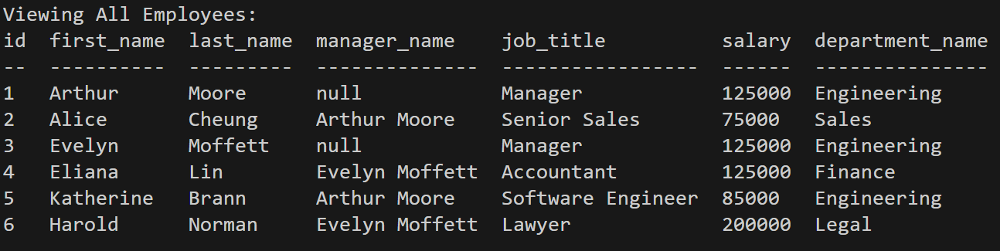

# employee-tracker


Walk-through Video: https://watch.screencastify.com/v/yS1ViznMlLIaraGYa4tr

## Description

In this project, a command-line application is built from scratch to manage a company's employee database, using Node.js, Inquirer, and MySQL. This content management systems (CMS) will assist user to view and manage the departments, roles, and employees in company. 

Schema for database is shown below:


## Table of Contents

* [Installation](#installation)

* [Technology](#technology)

* [Usage](#usage)

* [License](#license)

* [Contributing](#contributing)

* [Tests](#tests)

* [Questions](#questions)


## Installation

To install dependencies, run these commands:

```
npm install
```

## Technology
Technology used:
- node.js
- Inquirer
- MySQL database

## Usage
- User can view all departments.


- User can view all roles.


- User can view all employees.




- User can add a department.

- User can add a role.

- User can add an employee.

- User can update an employee role.

## License

      Copyright © MIT. All rights reserved. 
      
      Licensed under the MIT license.


## Contributing
To make this project better, please fork the repo and create a pull request. You can also simply open an issue with the tag "enhancement".

* Fork the Project
* Create your Feature Branch (git checkout -b feature/AmazingFeature)
* Commit your Changes (git commit -m 'Add some AmazingFeature')
* Push to the Branch (git push origin feature/AmazingFeature)
* Open a Pull Request

## Tests

To run tests, run these commands:

```
npm run test
```

## Questions
This project is contributed by [yul402](https://github.com/yul402/)

Contact infotmation: Ying.li20@outlook.com
