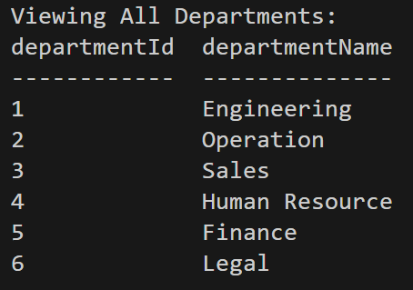
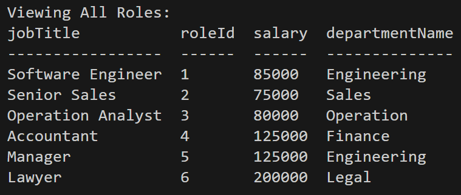

# employee-tracker


Walk-through Video: 

## Description

In this project, a command-line application is built from scratch to manage a company's employee database, using Node.js, Inquirer, and MySQL. This content management systems (CMS) will assist user to view and manage the departments, roles, and employees in company.

## Table of Contents

* [Installation](#Installation)

* [Technology](#technology)

* [Usage](#usage)

* [License](#license)

* [Contributing](#contributing)

* [Tests](#tests)

* [Questions](#questions)


## Installation

To install dependencies, run these commands:

```
npm install
```

## Technology
Technology used:
- node.js
- Inquirer
- MySQL database

## Usage
- User can view all departments.


- User can view all roles.


- User can add a department.


- User can add a role.


- User can add an employee.


- User can update an employee role.


## License

      Copyright © MIT. All rights reserved. 
      
      Licensed under the MIT license.


## Contributing
To make this project better, please fork the repo and create a pull request. You can also simply open an issue with the tag "enhancement".

* Fork the Project
* Create your Feature Branch (git checkout -b feature/AmazingFeature)
* Commit your Changes (git commit -m 'Add some AmazingFeature')
* Push to the Branch (git push origin feature/AmazingFeature)
* Open a Pull Request

## Tests

To run tests, run these commands:

```
npm run test
```

## Questions
This project is contributed by [yul402](https://github.com/yul402/)

Contact infotmation: Ying.li20@outlook.com
